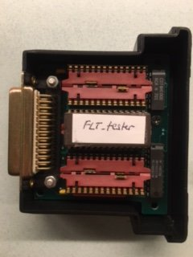
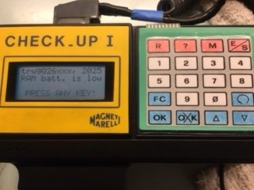
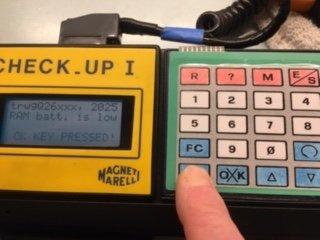

# Fiat Lancia Tester Tester

Test ROM for FLT\ART\CU-1. Tests the LCD, keyboard and the battery in the RAM.

# Usage

Load it onto the module as ROMB (64k). ROMA and ROMC should remain unpopulated or empty (i.e., filled with 0xFF).

The RAM battery information is be displayed immediately on the screen, and the button information will change depending on which key is pressed. 

For example, if the OK key is pressed, it will display "OK key pressed". 

The keyboard scan is performed in the following order: R, 1, 5, FC, OK, ?, 2, 6, 9, NOK, M, 3, 7, 0, UP, E/S, 4, 8, RETRY, DOWN. The first key pressed will always be displayed on the screen according to this order. In other words, if the R and 5 keys are pressed simultaneously, the display will show "R key is pressed".

Note: The photos are from *pinino* from the AlfaBB.com forum. Thanks, Steven!

# Disclaimer

I do not consent to the use of all or part of the project for commercial purposes!

Nie wyrażam zgody na wykorzystanie całości bądź części projektu w celach zarobkowych!

# License

Shield: [![CC BY-NC-SA 4.0][cc-by-nc-sa-shield]][cc-by-nc-sa]

This work is licensed under a
[Creative Commons Attribution-NonCommercial-ShareAlike 4.0 International License][cc-by-nc-sa].

[![CC BY-NC-SA 4.0][cc-by-nc-sa-image]][cc-by-nc-sa]

[cc-by-nc-sa]: http://creativecommons.org/licenses/by-nc-sa/4.0/
[cc-by-nc-sa-image]: https://licensebuttons.net/l/by-nc-sa/4.0/88x31.png
[cc-by-nc-sa-shield]: https://img.shields.io/badge/License-CC%20BY--NC--SA%204.0-lightgrey.svg
